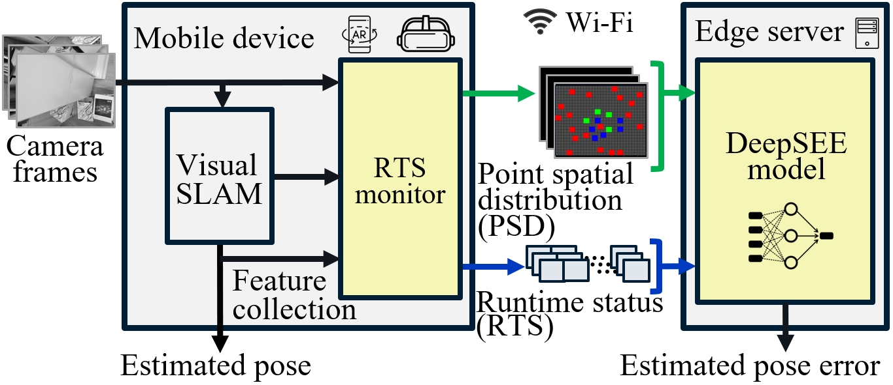

# SEESys (SLAM Error Estimation System)
 
This repository contains resources and research artifacts for the paper "_SEESys: Online Pose Error Estimation System for Visual SLAM_" that appeared in Proceedings of ACM SenSys 2024. 
It includes the [code required to implement SEESys](#implementation-resources), as well as [dataset](#datasets) we created to train and test our pose error estimation method.


# SEESys Overview

The SEESys has two main modules, the RTS monitor and the DeepSEE model. The RTS monitor is for collecting the RTS features and PSD matrix from the visual SLAM pipeline. The DeepSEE model estimates pose error based on the collected features from the RTS monitor.

# Implementation Resources

**Mobile device:** 
Please find the ***VisualSLAM*** folder for our implementation of RTS, built on top of ORB-SLAM3, where we integrate a data collection module as part of the visual SLAM and modify the tracking module, local mapping module to support our data collection from the SLAM pipeline.

**Server:**
Please find the ***DeepSEE*** folder for our implementation of the DeepSEE model.

In its ***Training*** folder, the ***Train-DeepSEE-CrossValidation.ipynb*** is the notebook to train and evaluate the DeepSEE model.

# Datasets

Please find the ***Datasets*** folder and its ***GenerateSLAMDataset.ipynb*** for our automation tool for generating the training set on both the real world SenseTime dataset and our synthetic dataset.


# Citation

If you use SEESys in an academic work, please cite: 

```
@inproceedings{SEESys24,
  title={SEESys: online pose error estimation system for visual SLAM},
  author={Hu, Tianyi and Scargill, Tim and Yang, Fan and Chen, Ying and Lan, Guohao and Gorlatova, Maria},
  booktitle={Proceedings of ACM SenSys 2024},
  year={2024}
 }
 ```